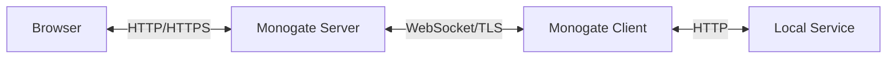
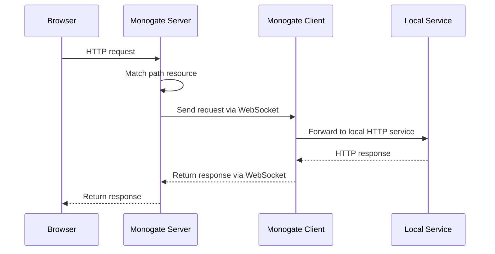
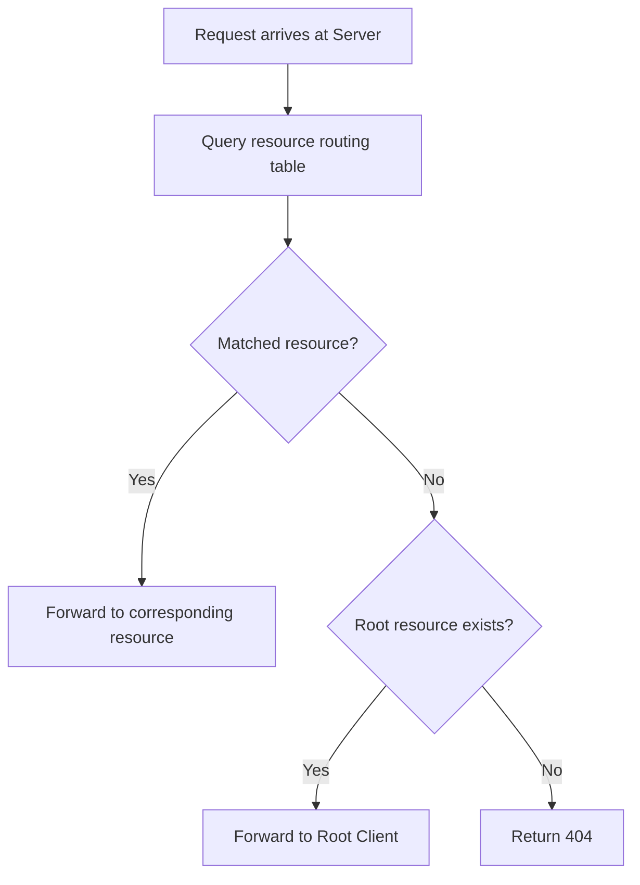

> Monogate's core architecture and data flow.

## Overall Architecture

## Core Components

### Server

Deployed on the public internet, responsible for:
- Receiving public HTTP requests
- Forwarding to Client via WebSocket
- Receiving Client responses and returning them to the browser
- Managing routes, Session, and authentication

### Client

Runs locally, responsible for:
- Establishing WebSocket connection with Server
- Receiving forwarded HTTP requests
- Forwarding to local service and obtaining responses
- Returning responses via WebSocket

### Communication Protocol

Server and Client communicate via WebSocket, transmitting control messages and HTTP request/response data:

- **Text channel**: Control commands (route registration, status queries, etc.)
- **Binary channel**: Streaming transmission of HTTP requests/responses

## Request Forwarding Flow

1. Browser sends HTTP request to Server
2. Server finds the corresponding Client Tunnel through route matching
3. Server splits the request into Header + Body, sends to Client via WebSocket
4. Client forwards request to local service
5. Client receives response, splits into Header + Body, returns via WebSocket
6. Server returns response to browser

## Key Design

- **Streaming transmission**: Header and Body are separated, Body is transmitted chunk by chunk, supporting large files
- **Session binding**: Requests from the same browser are associated via Session ID, supporting Cookie
- **Multiplexing**: A single WebSocket connection supports multiple concurrent requests
- **Abort mechanism**: When either end disconnects, the other end is notified to stop transmission

## Resource System

Monogate adopts a **dynamic resource** model, where each HTTP endpoint corresponds to a resource.

### Resource Types

| Type | Description | Example |
|------|------|------|
| **Built-in Resource** | Server built-in features, can be toggled | Embedded Console, WebSocket Tunnel endpoint |
| **Client Resource** | Routes registered by Client | `/api`, `/files`, and other custom paths |
| **Root Resource** | Root path set by Client | Default resource mapped by `--root` |

### Resource Matching Rules

1. **Endpoint uniqueness**: Each endpoint can only correspond to one resource, no duplicates allowed
2. **Exact match priority**: Exact paths are matched first, then wildcards
3. **Root fallback**: When a request path does not match any resource, it is forwarded to the Client that set `--root`

### Matching Flow

## Single WebSocket Connection Model

There is only **one** WebSocket connection between Server and Client, and all HTTP requests and responses are transmitted through this connection.

Each request is identified by `request_id` (UUID) to ensure no confusion during concurrent requests.
