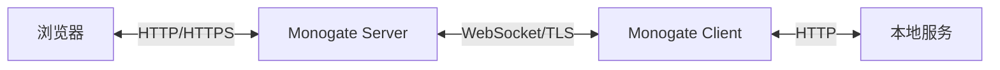
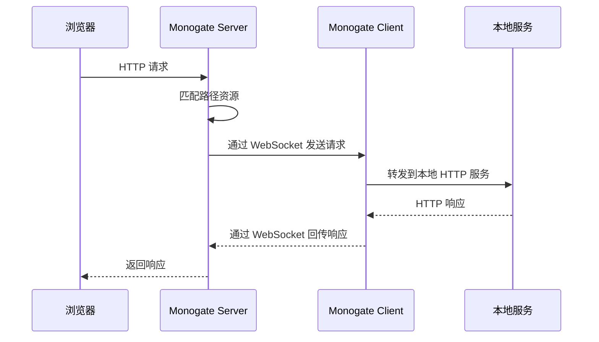
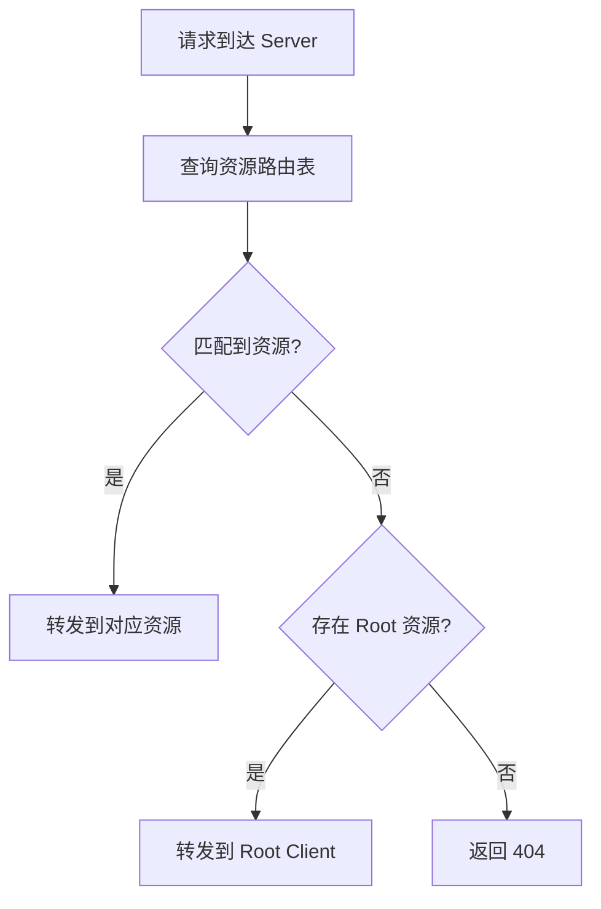

> Monogate 的核心架构与数据流。

## 整体架构

## 核心组件

### Server（服务端）

部署在公网，负责：
- 接收公网 HTTP 请求
- 通过 WebSocket 转发给 Client
- 接收 Client 的响应并返回给浏览器
- 管理路由、Session、认证

### Client（客户端）

运行在本地，负责：
- 与 Server 建立 WebSocket 连接
- 接收转发的 HTTP 请求
- 转发到本地服务并获取响应
- 通过 WebSocket 回传响应

### 通信协议

Server 与 Client 之间通过 WebSocket 传输控制消息和 HTTP 请求/响应数据：

- **文本通道**：控制命令（路由注册、状态查询等）
- **二进制通道**：HTTP 请求/响应的流式传输

## 请求转发流程

1. 浏览器发送 HTTP 请求到 Server
2. Server 通过路由匹配找到对应的 Client Tunnel
3. Server 将请求拆分为 Header + Body，通过 WebSocket 发送给 Client
4. Client 转发请求到本地服务
5. Client 收到响应，拆分为 Header + Body，通过 WebSocket 回传
6. Server 将响应返回给浏览器

## 关键设计

- **流式传输**：Header 与 Body 分离，Body 逐 chunk 传输，支持大文件
- **Session 绑定**：同一浏览器的请求通过 Session ID 关联，支持 Cookie
- **多路复用**：单 WebSocket 连接支持多个并发请求
- **Abort 机制**：任一端断开时，通知对端停止传输

## 资源系统

Monogate 采用**动态资源**模型，每个 HTTP endpoint 对应一个资源。

### 资源类型

| 类型 | 说明 | 示例 |
|------|------|------|
| **内置资源** | Server 内置功能，可开关 | Embedded Console、WebSocket Tunnel 端点 |
| **Client 资源** | Client 注册的路由 | `/api`、`/files` 等自定义路径 |
| **Root 资源** | Client 设置的根路径 | `--root` 映射的默认资源 |

### 资源匹配规则

1. **Endpoint 唯一性**：每个 endpoint 只能对应一个资源，不可重复
2. **精确匹配优先**：先匹配精确路径，再匹配通配符
3. **Root 兜底**：当请求路径匹配不到任何资源时，转发到设置了 `--root` 的 Client

### 匹配流程

## 单 WebSocket 连接模型

Server 和 Client 之间只有**一条** WebSocket 连接，所有 HTTP 请求和响应都通过这条连接传输。

每个请求通过 `request_id`（UUID）标识，确保多请求并发时不会混淆。
